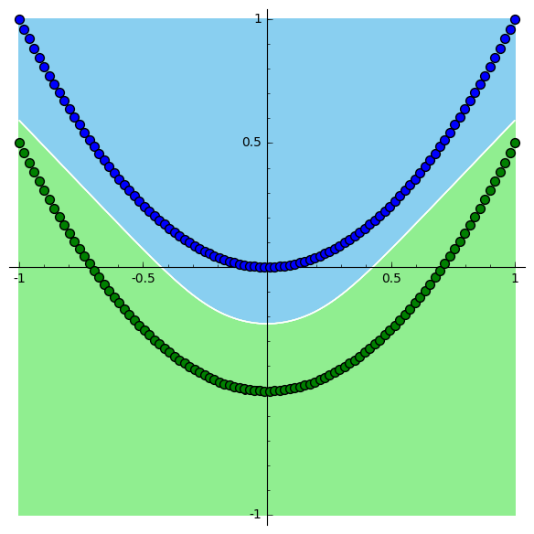
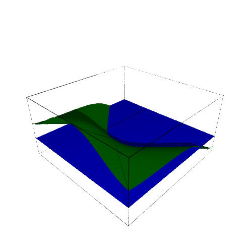
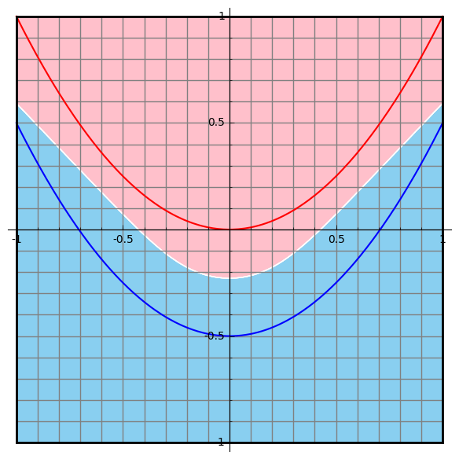
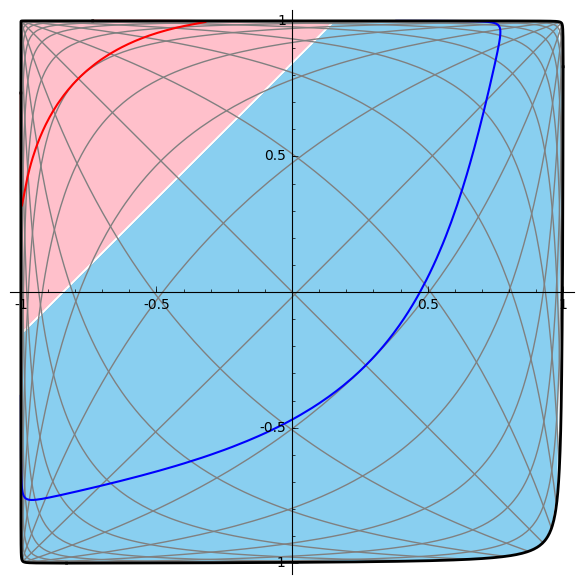

# machine-learning-tutorials

Tutorials that provide intuition about the separating planes and surfaces of
linear and non-linear classifiers.

### Requirements

- Python
- Numpy
- SageMath

### Space Transformation

Let us explore the following example, having parabolic data points separated in
two classes. A neural network can trivially solve this problem even with a small
depth. The example data points and the separating planes look like the
following:

The separating hyperplane can be illustrated better in 3D space:

Accordingly, if we picture the data-generating functions as continuous functions
in a continuous space, we get the following:

Finally, the applied neural network transformation to the data can be seen as a
transformation to the data space followed be a linear separating hyperplane:

### Thanks

Inspired by Christopher Olah's post on [Neural Networks, Manifolds and Topology](http://colah.github.io/posts/2014-03-NN-Manifolds-Topology/)
